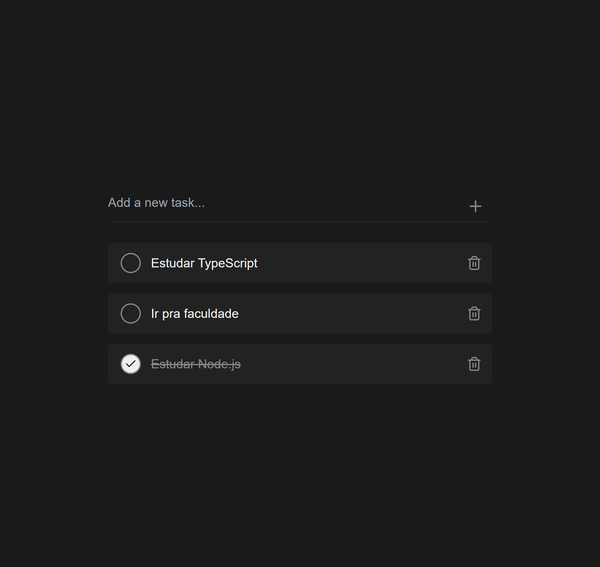

# To-Do List

O foco principal deste projeto foi a prática de **Tailwind CSS** para a construção de interfaces.

## Pré-visualização

## Funcionalidades

- **Adicionar Tarefas:** Um campo de entrada permite que você adicione novas tarefas à sua lista de forma rápida e intuitiva. Tarefas em branco ou que contêm apenas espaços não são adicionadas.
- **Marcar como Concluída:** Clique no círculo ao lado de uma tarefa para marcá-la como concluída. O estilo visual da tarefa mudará para indicar seu status, com o texto sendo riscado e um ícone de "check" aparecendo.
- **Excluir Tarefas:** Remova facilmente tarefas da sua lista clicando no ícone da lixeira, mantendo sua lista sempre organizada e atualizada.
- **Persistência de Dados:** Suas tarefas são salvas localmente no seu navegador usando `localStorage`. Isso significa que, mesmo que você feche ou atualize a página, suas tarefas permanecerão salvas e estarão lá quando você voltar.
- **Interface Reativa:** A lista de tarefas é atualizada em tempo real. Qualquer adição, exclusão ou alteração de status é refletida na tela instantaneamente, sem a necessidade de recarregar a página.
- **Exibição Condicional:** Uma mensagem amigável é exibida quando não há tarefas na lista, informando ao usuário que ele pode começar a adicionar novas tarefas.

## Tecnologias

- React
- JavaScript
- Vite
- Tailwind CSS